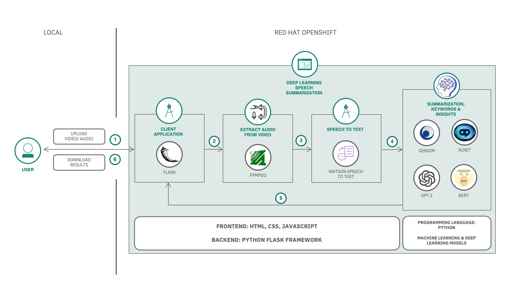
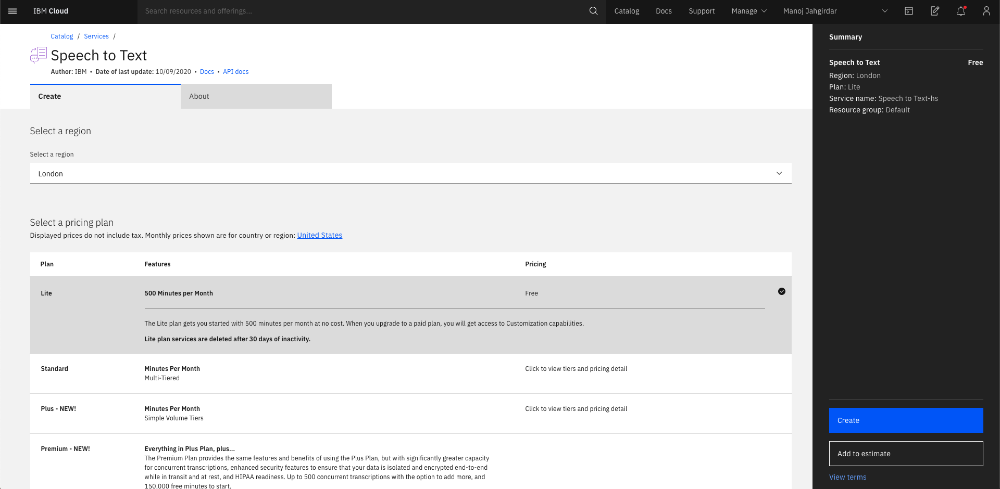
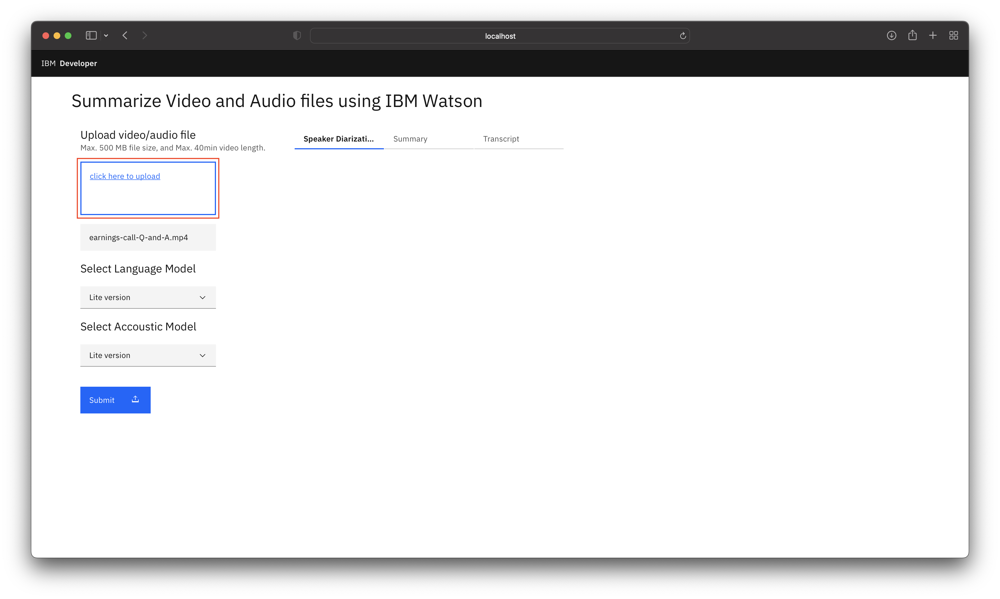
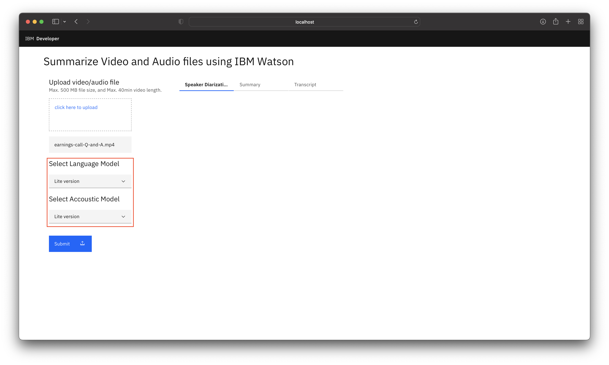
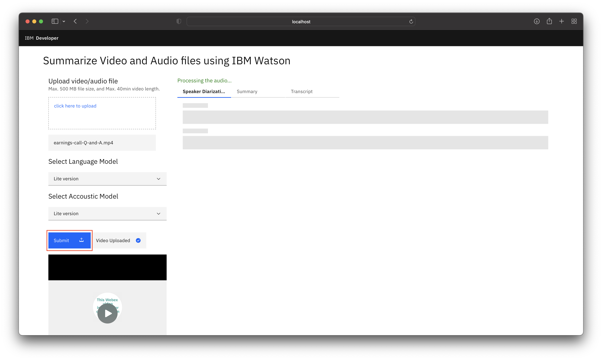
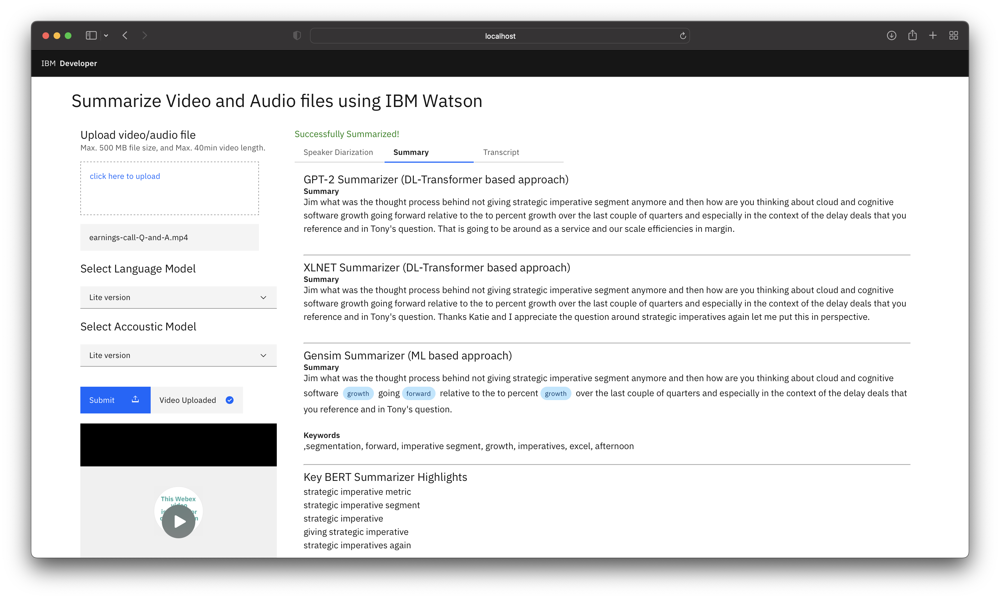
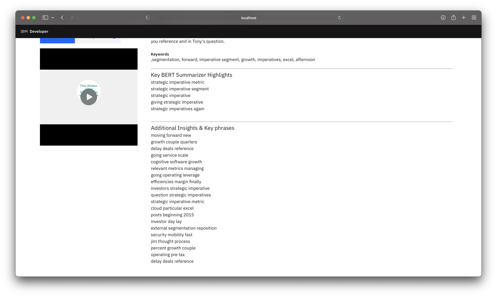
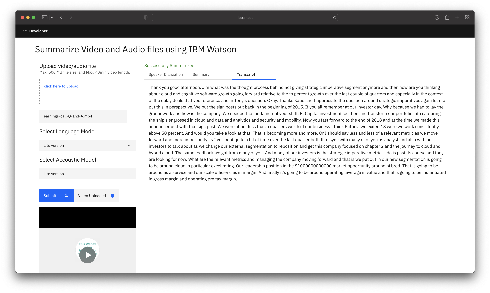

# Summarize a video or audio file using IBM Watson 

In this code pattern, you will learn to build an end to end framework for generating summaries & insights from video and/or audio files using a combination of IBM and Open source technologies.

Its always beneficial if we can get a gist of the content without going through the entire data and the problem adds more complexity if the data is in the form of a video or audio file. In this code pattern you will learn about building a robust solution for analyzing the video or audio files to quickly generate meaningful summary & insights using different Deep learning and Machine learning approaches. You will also learn about improving the readibility of the transcripts with IBM Watson Speech to Text speech recognition models, how to optimize the parameteres, train different speech to text models and learn about different state of the art language models used for summarizing the text. 

When you have completed this code pattern, you will understand how to:

* Use Watson Speech to Text service to convert the human voice into the written word.
* Transcribe video/audio with greater readibility by tuning the Watson Speech to Text parameters.
* Generate summary, highlights & insights using Transformer & ML based models.
* Visualize the results on the GUI for quick consumption and analysis.

<!--add an image in this path-->


<!--Optionally, add flow steps based on the architecture diagram-->
## Flow

1. User uploads a video or audio file.
2. If it is a video, then audio is extracted from the video.
3. The audio is sent to Watson Speech to Text that transcribes the audio to text.
4. The text is processed to extract summary, keywords & insights with different approaches.
5. The speaker diarization, summary and transcript are displayed on the UI.
6. User can then download the insights.

<!--Optionally, update this section when the video is created-->
## Watch the Video

<!-- [](https://www.youtube.com/watch?v=zEHNVXtspM0) -->
<iframe src="https://www.youtube.com/embed/zEHNVXtspM0" frameborder="0" allowfullscreen width="560" height="315"></iframe>

## Steps

1. [Clone the repo](#1-clone-the-repo)
1. [Create Watson Services](#2-create-watson-services)
    - 2.1. [Create Watson Speech to Text service on IBM Cloud](#21-create-watson-speech-to-text-service-on-ibm-cloud)
    - 2.2. [Add Watson Speech to Text credentials to the application](#22-add-watson-speech-to-text-credentials-to-the-application)
1. [Run the Application](#3-run-the-application)
1. [Generate summary and insights from the data](#4-generate-summary-and-insights-from-the-data)
1. [Watson Speech to Text Optimization](#5-watson-speech-to-text-optimization)
1. [Summarizer Models Optimization](#6-summarizer-models-optimization)

## 1. Clone the repo

Clone the `video-summarizer-using-watson` repo locally. In a terminal, run:

```bash
git clone https://github.com/IBM/video-summarizer-using-watson.git
```

### Application Directory structure

The Application is built on Python Flask Framework.

* The directory structure is as follows:

    <pre>
    .
    ├── Dockerfile
    ├── LICENSE
    ├── Notebooks
    │   ├── IBM Watson Speech to Text custom model training.ipynb
    │   └── Summarize.ipynb
    ├── Procfile
    ├── README.md
    ├── apis
    │   ├── __init__.py
    │   ├── summarizer.py
    │   ├── videoUtils.py
    │   └── watsonSpeechToText.py
    ├── app.py
    ├── deploy.yaml
    ├── manifest.yml
    ├── requirements.txt
    ├── static
    │   ├── audios
    │   ├── chunks
    │   ├── credentials
    │   │   └── speechtotext.json
    │   ├── css
    │   │   └── style.css
    │   ├── images
    │   ├── js
    │   │   └── script.js
    │   ├── transcripts
    │   └── videos
    │       └── wc.png
    └── templates
        └── index.html
    </pre>

* `apis/` contains the API endpoints.
  * `/api/v1.0/uploadVideo`: This API is used to upload the video file, extract audio from the video file, detect long pauses in the audio file and split the audio file into chunks.
  * `/api/v1.0/transcribe/<string:model>`: This API is used to transcribe the audio files using Watson Speech to Text.
  * `/api/v1.0/summarize`: This API is used to summarize the text using GTP-2, Gensim and XLNET summarizers.
* `static/` contains the following static files.
  * `credentials/` contains the credentials for Watson Speech to Text.
  * `videos/` contains the uploaded video files.
  * `audios/` contains the extracted audio files.
  * `transcripts/` contains the transcribed text files.
  * `chunks/` contains the audio chunks.
  * `css/` contains the CSS files.
  * `js/` contains the JavaScript files.
* `templates/` contains the HTML templates.
* `app.py` is the main application file to run the flask server.
* `Dockerfile` is the Dockerfile to build the Docker image.
* `requirements.txt` is the list of requirements for the application.
* `deploy.yaml` is the deployment configuration file.

## 2. Create Watson Services

### 2.1. Create Watson Speech to Text service on IBM Cloud

* Login to IBM Cloud, create a [Watson Speech To Text Service](https://cloud.ibm.com/catalog/services/speech-to-text), and click on `create` as shown.


* In Speech To Text Dashboard, Click on `Services Credentials`.


- Click on `New credential` and add a service credential as shown.


- Copy the credentials.

### 2.2. Add Watson Speech to Text credentials to the application

* Add the Watson Speech to Text credentials in the `static/credentials/speechtotext.json` file.

    ```json
    {
        "apikey": "xxxx",
        "iam_apikey_description": "xxxx",
        "iam_apikey_name": "xxxx",
        "iam_role_crn": "xxxx",
        "iam_serviceid_crn": "xxxx",
        "url": "xxxx"
    }
    ```

## 3. Run the Application

You can choose to run the application Locally or deploy on Red Hat OpenShift or deploy on IBM Public Cloud Foundry.

<details><summary><b>Locally</b></summary>

* Navigate to the root of the cloned repo. In terminal, run the following command:

    ```docker
    docker build -t video-summarizer-using-watson:v1.0 .
    ```

* Run the application locally. In terminal, run the following command:

    ```docker
    docker run -p 8080:8080 video-summarizer-using-watson:v1.0
    ```

* Visit <http://localhost:8080> to see the application.

</details>

<details><summary><b>Red Hat OpenShift</b></summary>

### Steps to Build and Deploy on OpenShift

#### Build

> Note: Make sure you have docker cli installed and logged in to DockerHub

* In cloned repo, build the docker image. In terminal run:

    ```bash
    docker build -t <your-docker-username>/video-summarizer-using-watson:v1.0 .
    ```

    > Replace `<your-docker-username>` with your docker hub username

* Once the docker image is built, deploy the docker image to Dockerhub. In terminal run:

    ```bash
    docker push <your-docker-username>/video-summarizer-using-watson:v1.0
    ```

* At this point you have built the container image and successfully pushed to to a container repository dockerhub.

* Copy the image tag `<your-docker-username>/video-summarizer-using-watson:v1.0` and replace it on line no `18` in [deploy.yaml](deploy.yaml)

    <pre><code>spec:
        containers:
        - name: video-summarizer-using-watson
            image:<b> < your-docker-username >/video-summarizer-using-watson:v1.0 </b>
            ports:
            - containerPort: 8080
    </code></pre>

#### Deploy

* Login to your OpenShift cluster, In terminal run:

    ```bash
    oc login -u <username> -p <password>
    ```

* Alternatively you can also login with an auth token. Follow the [Step here](https://developer.ibm.com/tutorials/configure-a-red-hat-openshift-cluster-with-red-hat-marketplace/#4-connect-to-the-openshift-cluster-in-your-cli) to login through an auth token.

* Once you have logged into OpenShift from your terminal, you can run the `oc apply` command to deploy the Application on OpenShift. In cloned repo, navigate to `` directory and in terminal run:

    ```bash
    oc apply -f deploy.yaml
    ```

    ```
    deployment.apps/video-summarizer-using-watson-deployment created
    service/video-summarizer-using-watson-service created
    ```
* Run the `oc get services` to get the service External URL.
   
   ```bash
   oc get services | grep video-summarizer-using-watson-service
   ```

   ```bash
   NAME                        TYPE           CLUSTER-IP       EXTERNAL-IP                            PORT(S)        AGE
   video-summarizer-using-watson-service             LoadBalancer   172.21.170.157   169.60.236.228                         80:32020/TCP   2m
   ```

* At this point, you will have successfully deployed the Application on OpenShift.

* Visit **EXTERNAL-IP** for example: <http://169.60.236.228> to see the application.

</details>

<details><summary><b>IBM Public Cloud Foundry</b></summary>

### Steps to Build and Deploy on IBM Public Cloud Foundry

#### Build and Deploy

* Before you proceed, make sure you have installed [IBM Cloud CLI](https://cloud.ibm.com/docs/cli?topic=cloud-cli-getting-started&locale=en-US) in your deployment machine.

> Note: You need to set the `disk-quote` to be more than 2GB since pytorch library is huge and requires more than 2GB of disk space to get installed.

* From the cloned repo, in terminal, run the following commands to deploy the Application to IBM Cloud Foundry.

    * Log in to your IBM Cloud account, and select an API endpoint.

        ```bash
        ibmcloud login
        ```

        >NOTE: If you have a federated user ID, instead use the following command to log in with your single sign-on ID.

        ```bash
        ibmcloud login --sso
        ```

    * Target a Cloud Foundry org and space:

        ```bash
        ibmcloud target --cf
        ```

    * From within the root of the cloned repo, push your app to IBM Cloud.

        ```bash
        ibmcloud cf push video-summarizer-using-watson
        ```

* The [manifest.yml](manifest.yml) file will be used here to deploy the application to IBM Cloud Foundry.

* On Successful deployment of the application you will see something similar on your terminal as shown.

    <pre><code>
    Invoking 'cf push'...
    Shown below is a sample output

    Pushing from manifest to org abc@in.ibm.com / space dev as abc@in.ibm.com...

    ...

    Waiting for app to start...

    name:              video-summarizer-using-watson
    requested state:   started
    routes:            <b>video-summarizer-using-watson.xx-xx.mybluemix.net </b>
    last uploaded:     Sat 16 May 18:05:16 IST 2020
    stack:             cflinuxfs3
    buildpacks:        python

    type:            web
    instances:       1/1
    memory usage:    4G
    start command:   python app.py
        state     since                  cpu     memory           disk           details
    #0   <b>running</b>   2020-05-16T12:36:15Z   12.6%   116.5M of 4G   
    </code></pre>

* Once the app is deployed, from the output of the above command, you can visit the `routes` to launch the application.

* At this point, you will have successfully deployed the Application on IBM Cloud.

* Visit <http://video-summarizer-using-watson.xx-xx.mybluemix.net> to see the application.

</details>

## 4. Generate summary and insights from the data

* Upload any video/audio file. (.mp4/.mov or .mp3/.wav). You can use the dataset provided in the repo [data/earnings-call-2019.mp4](data/earnings-call-2019.mp4) or [data/earnings-call-Q-and-A.mp4](data/earnings-call-Q-and-A.mp4)


<details><summary><b>About the Dataset</b></summary>

For the code pattern demonstration, we have considered `IBM Earnings Call Q1 2019` Webex recording. The data has 20+ min of IBM Revenue discussion, and 2+ min of Q & A at the end of the recording. We have split the data into 2 parts:

- `earnings-call-2019.mp4` - (Duration - 24:40)
This is IBM revenue discussion meeting recording.

- `earnings-call-Q-and-A.mp4` - (Duration - 2:40)
This is a part of Q & A's asked at the end of the meeting.

</details>

* Select the Watson Speech to Text Language and Acoustic Model.


    >Custom language model is built to recognize the **out of vocabulary**  words from the audio. [Learn more](https://cloud.ibm.com/docs/speech-to-text?topic=speech-to-text-languageCreate)

    >Custom accoustic model is built to recognize the **accent** of the speaker from the audio. [Learn more](https://cloud.ibm.com/docs/speech-to-text?topic=speech-to-text-acoustic)

    >NOTE: A **Standard account** is required to train a custom Speech To Text Model. There are three types of plans, Lite (FREE), Standard and Premium (PAID) for more info visit <https://cloud.ibm.com/catalog/services/speech-to-text>

    >You can refer to the [IBM Watson Speech to Text custom model training.ipynb](Notebooks/IBM%20Watson%20Speech%20to%20Text%20custom%20model%20training.ipynb) notebook to learn in detail how to build and train custom Watson Speech to Text models.

* Click on submit.


* It will take approximately the same amount of time as the duration of the video to process the Speaker Diarized Output, Summary and Transcript.

* You can view the Speaker Diarized Output.


>Speaker Diarization is a process of extracting multiple speakers information from an audio. [Learn more](https://en.wikipedia.org/wiki/Speaker_diarisation)

* You can view the Summary from Gensim, GPT2 & XLNet models which are ML & Transformer based approaches respectively. The insights are generated using KeyBert model. You can refer to this Jupyter Notebook [Custom-Models-for-Summarization-and-Insights.ipynb](https://github.com/IBM/video-summarizer-using-watson/blob/main/Notebooks/Custom-Models-for-Summarization-and-Insights.ipynb) and play around with the different settings of model hyperparameters to increase or decrease the size of the output to suit your requirements. 



* You can also view the transcript.


## 5. Watson Speech to Text Optimization
The Watson Speech to Text model can be optimized further to get more precise and accurate results. In this section you will learn about the following speech recognition parameters of the Watson Speech to Text:
- Speaker labels (Beta)
- Smart formatting
- End of phrase silence time
- Numeric redaction (Beta)
- Profanity filtering (Beta)

### Speaker Labels (Beta)

Speaker labels parameter in Watson™ Speech to Text, identifies which person spoke which words in a conversation. It is best optimized for two person conversation scenario, however it can support upto 6 person but the performance may vary. 

Example: Telephone conversation between two people, Q&A between two people, etc.

To enable Speaker labels, add the `speaker_labels` parameter and set it to `true`.

```python
def Transcribe(audiofilepath):
    with open(audiofilepath, 'rb') as audio_file:
        speech_recognition_results = speech_to_text.recognize(
                audio=audio_file,
                content_type='audio/wav',
                model='en-US_NarrowbandModel',
                speaker_labels=True
            ).get_result()

    return speech_recognition_results
```

>Note: We are using an **US English NarrowBand Model** to transcribe the audio. ***NarrowBand Model*** is optimized for human to human conversations, whereas, ***BroadBand Model*** is optimized for human to bot or vice-versa conversations. Change your model accordingly.

>Note: Speaker Labels is already enabled in this code pattern. ✔️

>Learn more about Speaker Labels [here](https://cloud.ibm.com/docs/speech-to-text?topic=speech-to-text-speaker-labels).

### Smart formatting

Smart formatting parameter in Watson™ Speech to Text, converts the following strings into more conventional representations:
- Dates
- Times
- Series of digits and numbers
- Phone numbers
- Currency values (for US English and Spanish)
- Internet email and web addresses (for US English and Spanish)

Example:

String Type|Smart formatting OFF ❌|Smart formatting ON ✔️
--|--|--
Dates|I was born on the ninth of December nineteen hundred|I was born on 12/9/1900
Times|The meeting starts at nine thirty AM|The meeting starts at 9:30 AM
Numbers|The quantity is one million one hundred and one dollar|The quantity is $1000101
Phone numbers|Call me at nine one four two three seven one thousand|Call me at 914-237-1000
Internet email and web addresses|My email address is john dot doe at foo dot com|My email address is john.doe@foo.com
Combinations|The code is zero two four eight one and the date of service is May fifth two thousand and one|The code is 02481 and the date of service is 5/5/2001

To enable Smart formatting, add the `smart_formatting` parameter and set it to `true`.

```python
def Transcribe(audiofilepath):
    with open(audiofilepath, 'rb') as audio_file:
        speech_recognition_results = speech_to_text.recognize(
                audio=audio_file,
                content_type='audio/wav',
                model='en-US_NarrowbandModel',
                speaker_labels=True,
                smart_formatting=True
            ).get_result()

    return speech_recognition_results
```

>Note: Speaker Labels is already enabled in this code pattern. ✔️

>Learn more about Smart formatting [here](https://cloud.ibm.com/docs/speech-to-text?topic=speech-to-text-formatting).

### End of phrase silence time

End of phrase silence time parameter in Watson™ Speech to Text, specifies the duration of the pause interval at which the transcript has to be split. This parameter improves the sentence formation in the transcript.

Example:

If a person speaks numbers such as one two three four with a pause between three and four, the transcript would be something like this if the End of phrase silence time not set:

"One two three"

"four"

However if the End of phrase silence time is set to say 1sec or 1.5sec then the transcript would be something like this:

"One two three four"

To enable End of phrase silence time, add the `end_of_phrase_silence_time` parameter and set it to desired time for example `1.5`sec.

```python
def Transcribe(audiofilepath):
    with open(audiofilepath, 'rb') as audio_file:
        speech_recognition_results = speech_to_text.recognize(
                audio=audio_file,
                content_type='audio/wav',
                model='en-US_NarrowbandModel',
                speaker_labels=True,
                smart_formatting=True,
                end_of_phrase_silence_time=1.5
            ).get_result()

    return speech_recognition_results
```

>Note: End of phrase silence time is already enabled in this code pattern. ✔️

>Learn more about End of phrase silence time [here](https://cloud.ibm.com/docs/speech-to-text?topic=speech-to-text-parsing#silence-time).

### Numeric redaction (Beta)

Numeric redaction parameter in Watson™ Speech to Text, masks the numeric data from final transcripts. It is a useful feature when dealing with PII data.

Example:

Numeric redaction OFF ❌|Numeric redaction ON ✔️
--|--
my credit card number is four one four seven two nine one three one seven eight two seven nine two six| my credit card number is xxxx-xxxx-xxxx-7926

To enable Numeric redaction, add the `redaction` parameter and and set it to `true`.

```python
def Transcribe(audiofilepath):
    with open(audiofilepath, 'rb') as audio_file:
        speech_recognition_results = speech_to_text.recognize(
                audio=audio_file,
                content_type='audio/wav',
                model='en-US_NarrowbandModel',
                speaker_labels=True,
                smart_formatting=True,
                end_of_phrase_silence_time=1.5,
                redaction=True
            ).get_result()

    return speech_recognition_results
```

>Learn more about Numeric redaction [here](https://cloud.ibm.com/docs/speech-to-text?topic=speech-to-text-formatting#numeric-redaction).

### Profanity filtering (Beta)

Profanity filtering parameter in Watson™ Speech to Text, censors profanity from its results. It is enabled by default, you can disable the feature if you want the words in the output exactly as transcribed.
 
Example:

Profanity filtering OFF ❌|Profanity filtering ON ✔️
--|--
_Fword_ you| **** you

To disable Profanity filtering, add the `redaction` parameter and and set it to `false`.

```python
def Transcribe(audiofilepath):
    with open(audiofilepath, 'rb') as audio_file:
        speech_recognition_results = speech_to_text.recognize(
                audio=audio_file,
                content_type='audio/wav',
                model='en-US_NarrowbandModel',
                speaker_labels=True,
                smart_formatting=True,
                end_of_phrase_silence_time=1.5,
                redaction=True,
                profanity_filter=False
            ).get_result()

    return speech_recognition_results
```

>Learn more about Profanity filtering [here](https://cloud.ibm.com/docs/speech-to-text?topic=speech-to-text-formatting#profanity-filtering).

## 6. Summarizer Models Optimization

The approaches used for extractive summarization are based on Transformer & Machine Learning.

`Transformer`

This approach pays equal attention to the words in the data and establish a relation between the words which are far from each other. Transformer approach works on attention mechanism to generate highly accurate and cohesive summary which can capture the context well and generate meaningful insights. 

`Hyperparameters`

We can adjust the summary size by setting the ratio (0.1 till 1 where the ideal setting would be ratio=0.2). We can also control the summary size by using the num_sentences parameter (ex:- num_sentences=10) to manually update the number of sentences to be present in the summarized output. There are a lot of other parameters that can be adjusted for different tasks like classification, sentence generation etc and for summarization the above mentioned parameters should ideally suffice. We can also re-train the models if required by referring to the link below.

Learn more about Transformers [here.](https://huggingface.co/docs/transformers/index)

`Machine Learning`

This approaches uses `Gensim` module for generating extractive summary. It uses the text rank algorithm to select the sentences on basis of the ranking of sentences in a specific order. Its a light weight module and can run on any setup (Cloud or local). 

`Hyperparameters`

We can control the summary size by using the ratio parameter (ex:- ratio=0.2) and word_count (ex:- word_count=250) parameter. This method is useful for generating quick summary and keywords and might need skilled inference to consume the output.


## Summary

In this code pattern you learned how to create an integrated system to convert speech to text, generate summary and insights from a video or audio file. You also learned about improving the readibility of the transcripts by tuning the parameters of Watson Speech to Text and finally you learned about different state of the art language models used for summarizing the text. 

This solution has wider applicability across domains to gather insights quickly from different data formats. This solution will be beneficial for Developers, Data Scientists & Architects to understand the Transformer based architecture & Watson Speech to Text capabilities to embed them in different apps to solve complex business problems associated with unstructured data.

<!-- keep this -->
## License

This code pattern is licensed under the Apache License, Version 2. Separate third-party code objects invoked within this code pattern are licensed by their respective providers pursuant to their own separate licenses. Contributions are subject to the [Developer Certificate of Origin, Version 1.1](https://developercertificate.org/) and the [Apache License, Version 2](https://www.apache.org/licenses/LICENSE-2.0.txt).

[Apache License FAQ](https://www.apache.org/foundation/license-faq.html#WhatDoesItMEAN)
